# DespliegueRecuperacion
Repositorio para realizar las prácticas de Despliegue

## Practica DNS

### Preparacion de los servidores DNS (new_dns)

1. Modificamos el archivo named y named.conf.options para configurar el servicio bind9. Definiendo la escucha en IP4, la validación DNSSEC, las consultas reculsivas solo para los autorizados y el reenvío de consultas externas. 

Ambos servidores tendrian los mismos archivos cambiando la sentencia listen-on con la ip correcta en el caso del named.conf.options ambos lo copiamos en su lugar y añadimos la sentencias al provision de cada servidor 

2. A continuaccion definimos las zonas directas y inversas en el named.conf.local tanto de *tierra* como de *venus*

**Tierra**:

**Venus**:

3. Creamos los arvhivos de zona tanto directa (db.sistema.test) como inversa (db.198.168.57). Con todos los tipos de registros especificados en la practica.

----------------------------------------------
1. Activa solamente la escucha del servidor para el protocolo IPv4

Para ellos tenemos que modificar el archivo named en  /etc/default/named y añadir -4 
Modificamos el named y lo copiamos en  /etc/default/ de cada maquina (venus y tierra)

2. Establecer la opción dnssec-validation a yes

Para ello ralizamos los pasos anteriores pero con el archivo named.conf.options y lo
volvemos a copiar en cada una de las maquinas en /etc/bind/

3. Los servidores permitirán las consultas recursivas sólo a los ordenadores en la red 127.0.0.0/8
y en la red 192.168.57.0/24, para ello utilizarán la opción de listas de control de acceso o acl.

Para ello modificamos el named.conf.options y añadimos una lista acl con las redes permitidas para 
realizar recursion

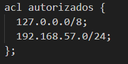

y añadimos en options: 

4. El servidor maestro será tierra.sistema.test y tendrá autoridad sobre la zona directa e inversa.

Para ello modificamos el named.conf.local para definir las zonas directas y inversas del maestro 
y permitir la transferencia al esclavo (Venus)

5. El servidor esclavo será venus.sistema.test y tendrá como maestro a tierra.sistema.test

Definimos en el named.conf.local que venus sera esclavo de tierra

6. El tiempo en caché de las respuestas negativas de las zonas (directa e inversa) será de dos horas
(se pone en segundos).

Creamos los archivos db.sistema.test y db.192 y añadimos los siguientes valores en cada uno

7. Aquellas consultas que reciba el servidor para la que no está autorizado, deberá reenviarlas
(forward) al servidor DNS 208.67.222.222 (OpenDNS).

Añadimos en el apartado options de named.conf.options del maestro (Tierra) el "forwarders" 

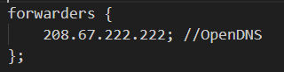

8. Se configurarán los siguientes alias:
    a. ns1.sistema.test. será un alias de tierra.sistema.test.
    b. ns2.sistema.test. será un alias de venus.sistema.test..

Añadimos los registros CAME con sus respectivos A

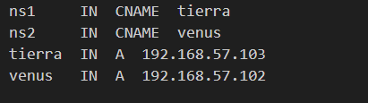     

9. mail.sistema.test. será un alias de marte.sistema.test.

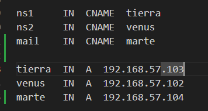 

10. El equipo marte.sistema.test. actuará como servidor de correo del dominio de correo
sistema.test.

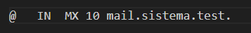 

Al final los ficheros db.sistema.test y db.192 se verian asi

### EN resumen

 1. Para tierra tendriamos los siguientes ficheros:

    _named.conf.local_
    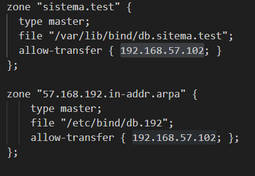 

    _named.conf.options_

    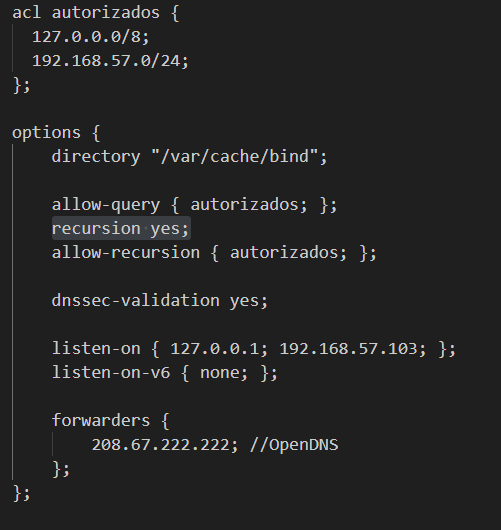 

    _db.sistema.test_

    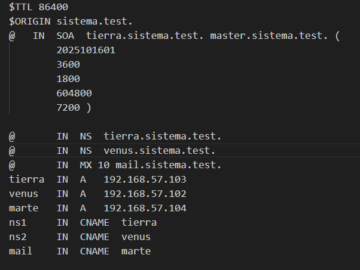 

    _db.192_

    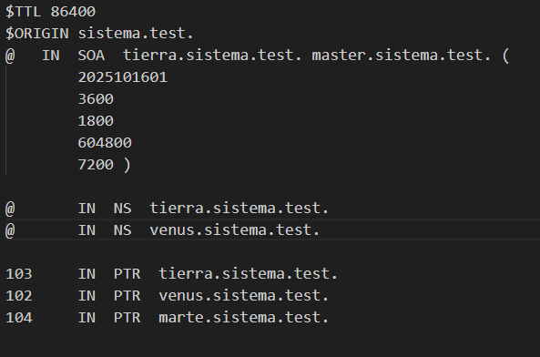 

 2. Para Venus tendriamos los siguientes ficheros:

    _named.conf.local_

    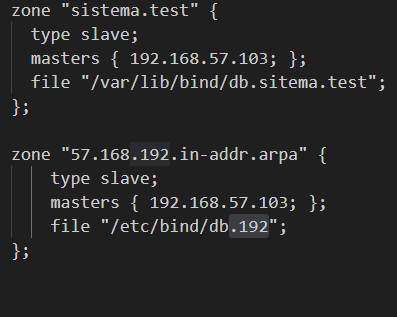 

    _named.conf.options_

    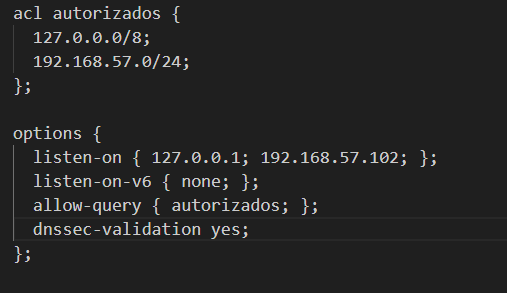 