# DespliegueRecuperacion
Repositorio para realizar las prácticas de Despliegue

# Practica DNS


1. Modificamos el archivo named y named.conf.options para configurar el servicio bind9. Definiendo la escucha en IP4, la validación DNSSEC, las consultas reculsivas solo para los autorizados y el reenvío de consultas externas. 

Ambos servidores tendrian los mismos archivos cambiando la sentencia listen-on con la ip correcta en el caso del named.conf.options ambos lo copiamos en su lugar y añadimos la sentencias al provision de cada servidor 


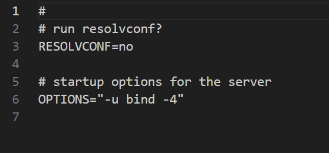


2. A continuaccion definimos las zonas directas y inversas en el named.conf.local tanto de *tierra* como de *venus*

**Tierra**:

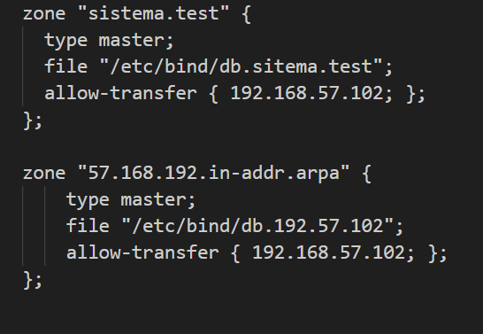


**Venus**:

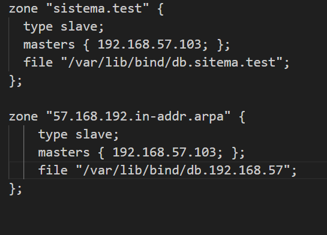

3. Creamos los arvhivos de zona tanto directa (db.sistema.test) como inversa (db.198.168.57). Con todos los tipos de registros especificados en la practica.


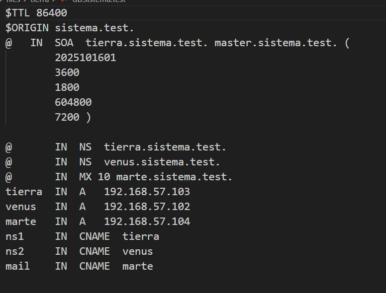
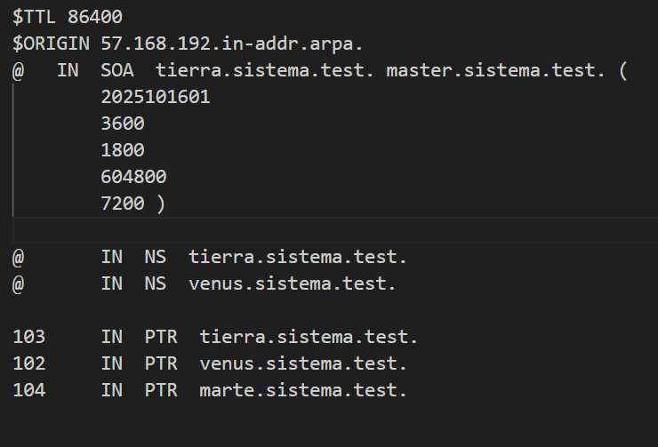

___

# Practica Nginx

## Instalacion y configuracion de servidor web Nginex (2.1)

1. Preparamos el archivo Vagranfile base con nginx y vemos que el servicio funciona correctamente


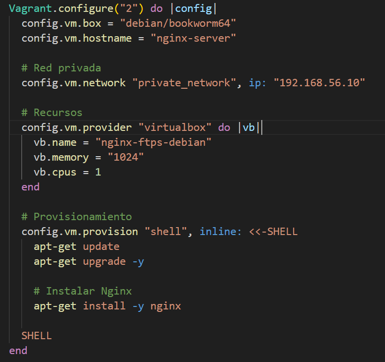
*vagranFile*

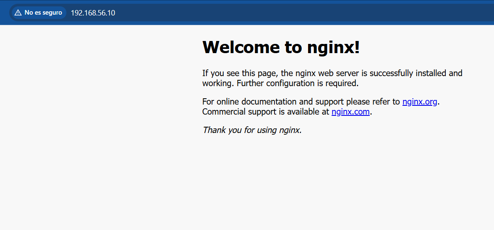
*nginx funcional*

2. Creamos la siguiente estructura de directorios */var/www/nginx_web/html* donde alojaremos la web de ejemplo. Dandole los permisos pertinenetes. 
Creamos un bloque de servidor para con los siguientes parametros en sites-avialable:

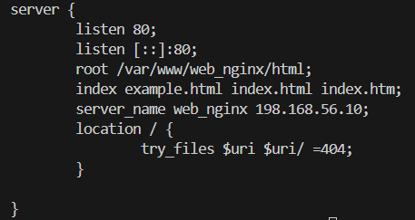

3. Creamos un enlace simbolico a sites-enabled y comprobamos que con la IP y con el nombre nos muestre la web: 

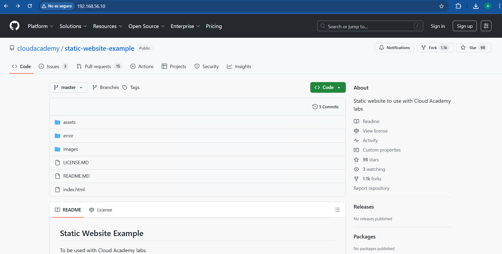
*IP*

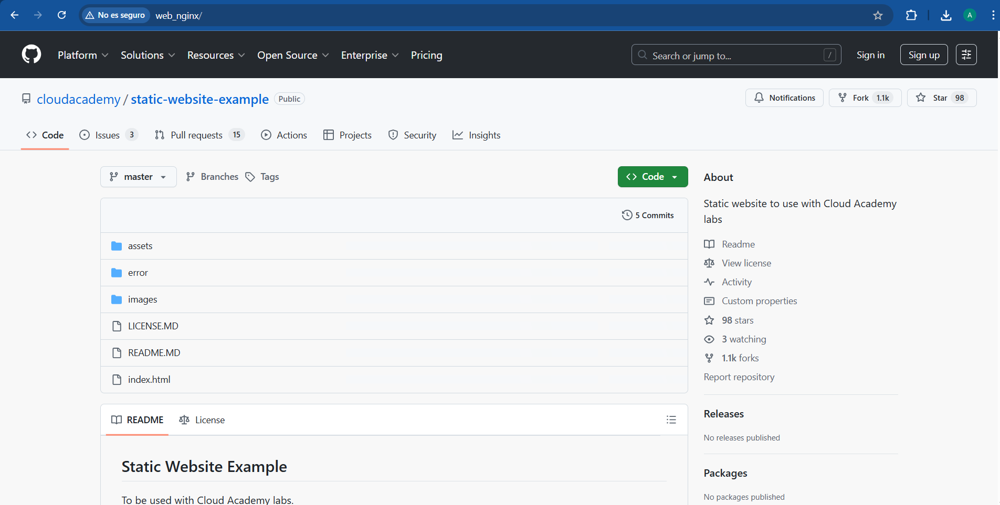
*we_nginx*

4. Comprobamos que se registran las peticiones tanto correctas como erroneas en *ascess.log* y *error.log*.


*ascess.log*

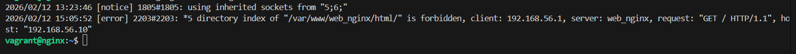
*error.log*


5. Configuración del FTP para la transferencia de archivos. Instalamos el vsftpd y creamos en el home un directorio llamadado ftp. Seguido creamos los certificados de seguridad con el siguiente comando: 

```bash
    sudo openssl req -x509 -nodes -days 365 -newkey rsa:2048 -keyout /etc/ssl/private/vsftpd.key -out /etc/ssl/certs/vsftpd.crt
```

6. Seguido pasamos a la configuración del vsftpd. Modificando el archivo */etc/vsftpd.conf*, donde elimnaremos las lineas siguienestes: 


y añadiremos las siguientes lineas:


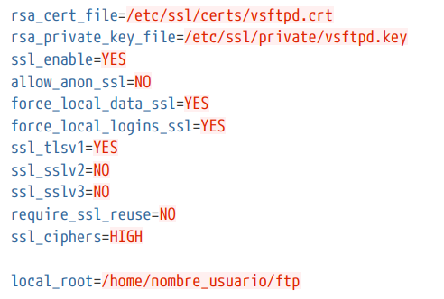

7. Despues de reiniciamos el servicio y ya podemos trasferir arvhivos mediante un cliente ftp como firezilla.


## Autentificacion en Nginx (2.2)

1. Insatalamos la herramienta openssl y pasamos a la configuración.

*Creamos el archivo oculto (.htpasswd)*
```bash
sudo touch /etc/nginx/.htpasswd
```
*Generamos un usuario y contraseña*
```bash
sudo sh -c "echo -n 'Alejandro:' >> /etc/nginx/.htpasswd" 
```
```bash
sudo sh -c "openssl passwd -apr1 '1234'>> /etc/nginx/.htpasswd" 
```

Repetimos el proceso con otro usuario: *Aguilera* y contraseña: *4321*

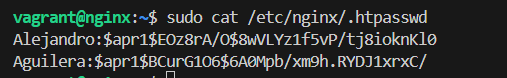
*contraseñas cifradas*

2. Añadimos la la nueva web siguiendo los passos de la prectica anterior y comprovamos que funciona modificando el bloq server: 


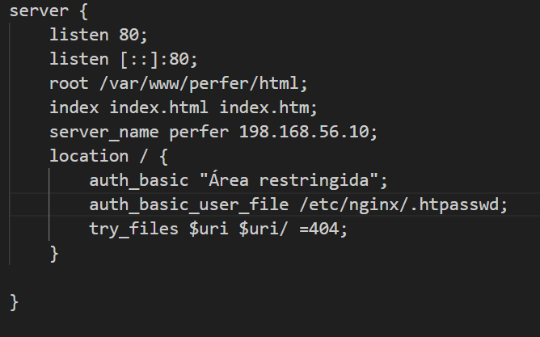
*bloq server*

3. Al aceder a la pagina mediante el nombre *perfer* nos indica que debemos autentificarnos.

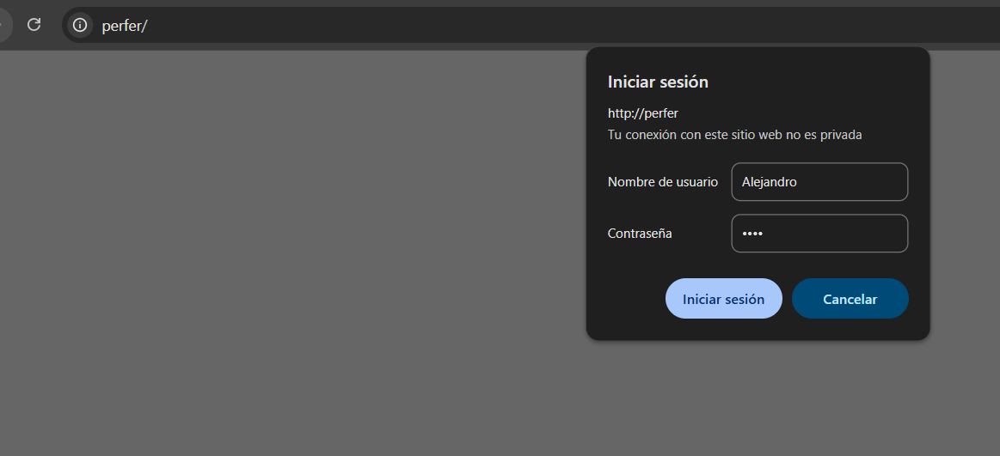

Una vez autenticados podemos acceder a la pagina sin ningun problema

4. Accedemos con un usuario erroneo y otro correcto y vemos que se ve reflejado en los log:

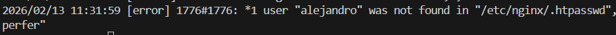

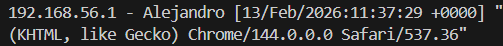

5. Realizamos lo mismo pero solo para el contact.html y comprobamos que funciona


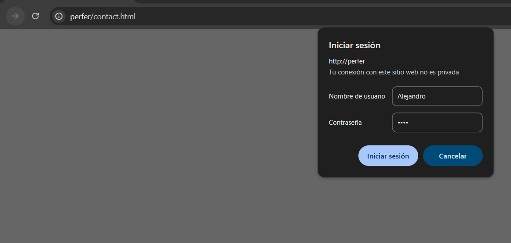

6. Ahora combinaremos las autentificacion basica con la restriccion de acceso IP, modificando el location. En este caso denegamos el acceso a la 192.168.1.5 y permitmos el 192.168.56.1 del anfitrión. 

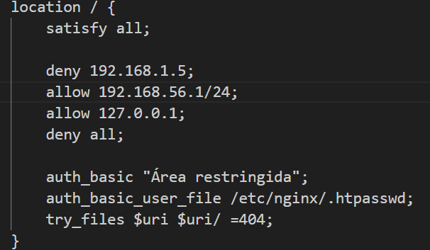

Lo comprobamos y vemos que dese nuestro anfitrion podemo acceder con ambos requisitos


Y Tambien le denegamos el acceso para que no pueda acceder con la IP del anfitrion en este caso nos muestra un forbiden (403).

*error forbidden*
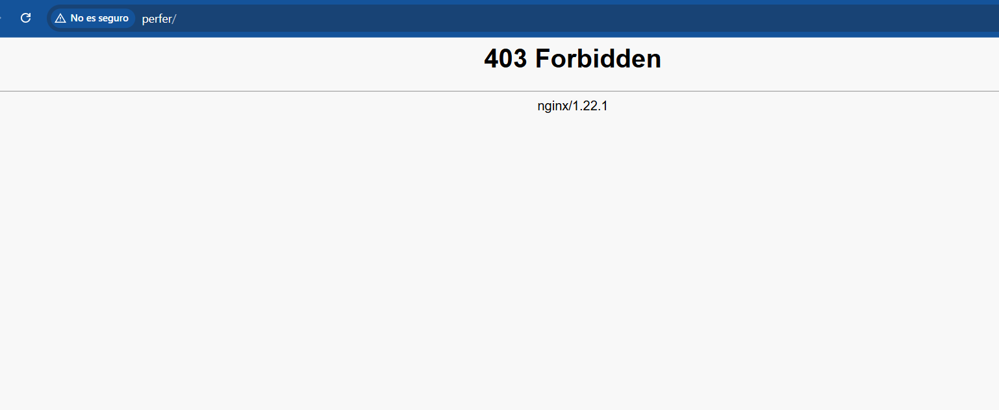

*error.log*


## Acceso seguro con Nginx (2.3)

1. Para esta practica vamos a definir en el *hosts* los registros A de *perfer* y *www.perfer.com* apuntando a la IP del servidor (*192.168.56.10*). 

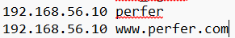

2. Pasamos a la comfigurazion del nginx añadiendo al *server_name* los dos nombres de dominio.

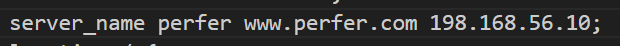

3. Configuramos el cortafuegos instalando el *ufw*, activamos el perfir para el trafico HTTPS, la conexión ssh y borramos las reglas de HTTP para evitar la duplicación. 

Utilizando los siguientes comandos: 

```bash
    sudo apt install ufw
```
```bash
    sudo ufw allow ssh
    sudo ufw allow 'Nginx Full'
    sudo ufw delete allow 'HTTP'
```

Comprobamos que esta tod funcionando correctamente y activaremos el cortafuegos con: 

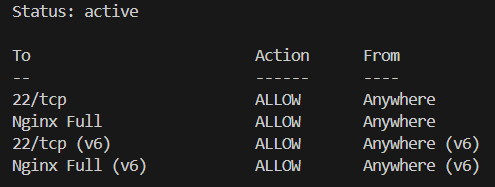

```bash
    sudo ufw --force enable
```

4. Con todo preprarado correctamente procedemos a general el certificado autofirmado.

Primero generamos el certificado con el siguiente comando *openssl*:  

```bash
    sudo openssl req -x509 -nodes -days 365 -newkey rsa:2048 -keyout /etc/ssl/private/perfer.com.key -out /etc/ssl/certs/perfer.com.crt
```
5. Configuramos el Nginx para funcionar con el certificado ssl, añadiendo las directivas ssl, comprobamos la sintaxis y reiniciamos el nginx. 

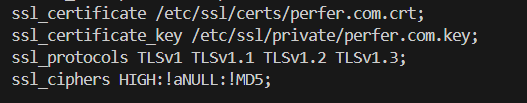

Seguido comprobamos que la web funciona con el certificado ssl:


En este caso vemos que el certificado funciona aunque nos muestre el *'no es seguro'*, esto ocurre por que es un certificado autofirmado y el cliente, en este caso chrome, no confia en el origen de este.

Para asegurarnos que Nginx esta escuchando por el 443 y esta sirviendo la paguina cifrada pordemos realizar los siguientes comandos: 

```bash
    sudo ss -tlnp | grep 443
```

El cual muestra: 

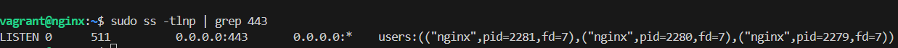


o utilizar tambien: 

```bash
    openssl s_client -connect perfer.com:443

```
Este nos muestra datos del certificado por tanto lo hemos realizado correctamente: 

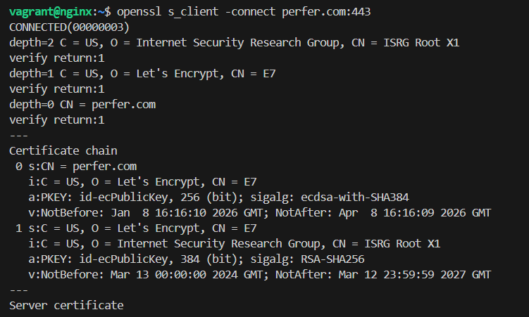


# Servidor de aplicaciones web 

## Despliegue con Tomcat y Maven para Java

1. Vamos a comenzar con la instalación de Tomcat 9 y el JDK para preparar la maquina. A parte crearemos un grupo para Tomcat y un usuario para el servicio. Iniacmos el Tomcat y vemos que funciona correcatemente.


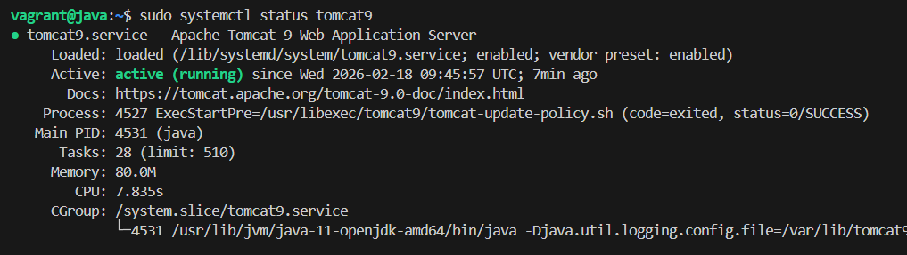

AL acceder al *Http://Localhost:8080*


2.

