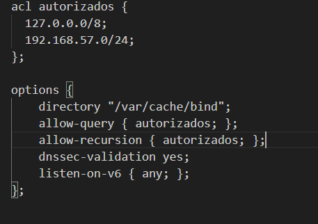

# DespliegueRecuperacion
Repositorio para realizar las prácticas de Despliegue

## Practica DNS

### Preparacion de los servidores DNS

1. Activa solamente la escucha del servidor para el protocolo IPv4

Para ellos tenemos que modificar el archivo named en  /etc/default/named y añadir -4 
Modificamos el named y lo copiamos en  /etc/default/ de cada maquina (venus y tierra)

2. Establecer la opción dnssec-validation a yes

Para ello ralizamos los pasos anteriores pero con el archivo named.conf.options y lo
volvemos a copiar en cada una de las maquinas en /etc/bind/

3. Los servidores permitirán las consultas recursivas sólo a los ordenadores en la red 127.0.0.0/8
y en la red 192.168.57.0/24, para ello utilizarán la opción de listas de control de acceso o acl.

Para ello modificamos el named.conf.options y añadimos una lista acl con las redes permitidas para 
realizar recursion

y añadimos en options: 

4. El servidor maestro será tierra.sistema.test y tendrá autoridad sobre la zona directa e inversa.

Para ello modificamos el named.conf.local para definir las zonas directas y inversas del maestro 
y permitir la transferencia al esclavo (Venus)

5. El servidor esclavo será venus.sistema.test y tendrá como maestro a tierra.sistema.test

Definimos en el named.conf.local que venus sera esclavo de tierra

6. El tiempo en caché de las respuestas negativas de las zonas (directa e inversa) será de dos horas
(se pone en segundos).

Creamos los archivos db.sistema.test y db.192 y añadimos los siguientes valores en cada uno

7. Aquellas consultas que reciba el servidor para la que no está autorizado, deberá reenviarlas
(forward) al servidor DNS 208.67.222.222 (OpenDNS).

Añadimos en el apartado options de named.conf.options del maestro (Tierra) el "forwarders" 

8. 